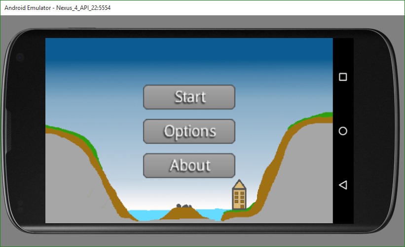
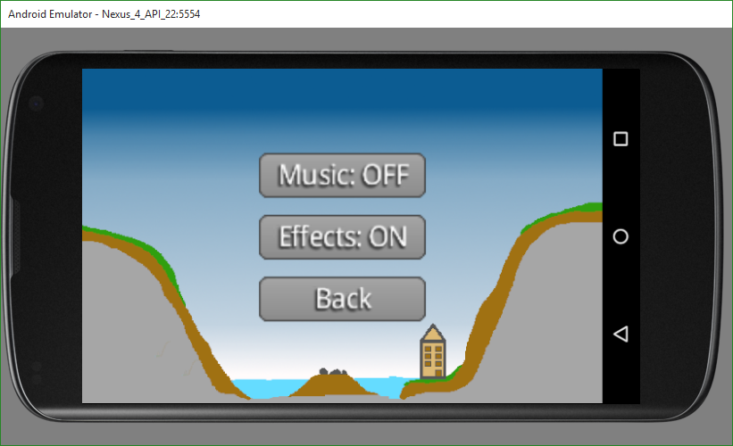
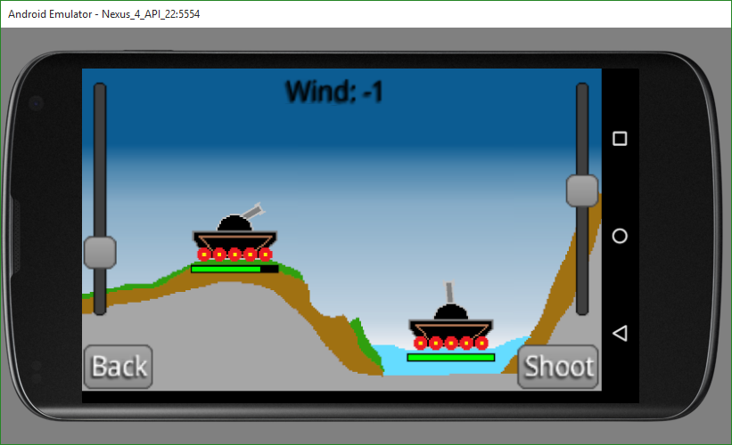

# SandBox
Sandox is a 2D Tank battle game in a fully destructible world.
The game is based on the 2d game development framework libgdx.

## Features
- Destructible 2d world with falling structures
- Different materials
- Fluids like water, lava, oil,...

## Some pictures
### Main Menu

### Options Menu

### Game Screen
